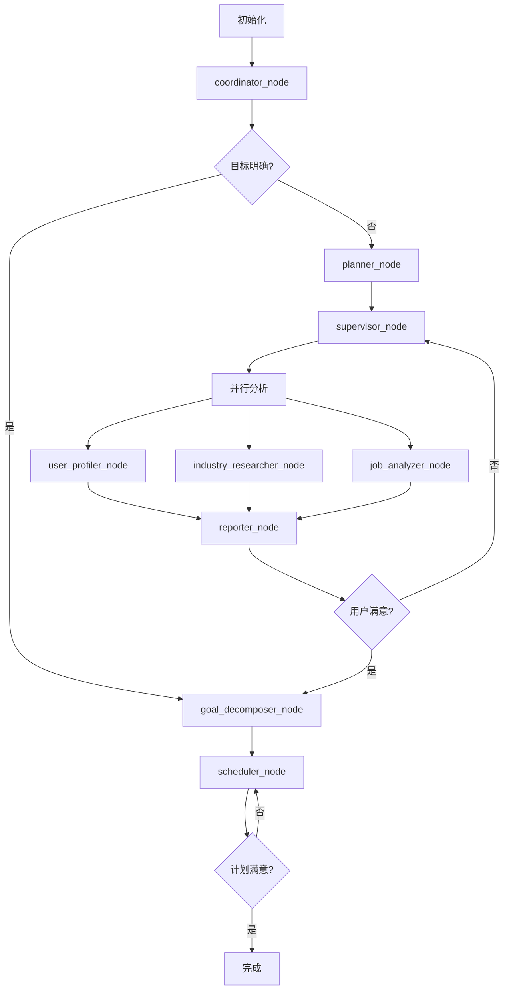

# CareerNavigator LangGraph 技术文档

本文档整合了 CareerNavigator 项目的完整 LangGraph 技术设计，包括工作流架构、状态管理、节点实现和字段参考。

## 📋 目录

1. [工作流概览](#工作流概览)
2. [状态设计](#状态设计)
3. [节点实现](#节点实现)
4. [状态流转图](#状态流转图)
5. [字段参考手册](#字段参考手册)

---

## 🏗️ 工作流概览

### 整体架构

```
初始化 → coordinator → [planner → supervisor] → 并行分析 → reporter → [迭代循环] → goal_decomposer → scheduler → 完成
```

### 核心阶段

| 阶段 | 英文名称 | 描述 | 关键节点 |
|------|----------|------|----------|
| 初始化 | INITIAL | 会话初始化，用户信息收集 | 系统初始化 |
| 策略制定 | PLANNING | 分析策略制定 | planner_node |
| 并行分析 | PARALLEL_ANALYSIS | 多智能体并行分析 | supervisor_node |
| 结果整合 | RESULT_INTEGRATION | 分析结果汇总 | reporter_node |
| 用户反馈 | USER_FEEDBACK | 用户满意度收集 | 用户交互 |
| 目标拆分 | GOAL_DECOMPOSITION | 职业目标细化 | goal_decomposer_node |
| 日程规划 | SCHEDULE_PLANNING | 行动计划制定 | scheduler_node |
| 最终确认 | FINAL_CONFIRMATION | 最终方案确认 | 系统确认 |
| 完成 | COMPLETED | 流程结束 | 会话结束 |

---

## 🔄 状态流转图

### 简化流程图



### 关键决策点

1. **coordinator_node 路由决策**
   ```
   输入: user_message, user_profile
   决策: LLM分析 → is_goal_clear, clarity_score
   路由: 
   - clarity_score > 70 → goal_decomposer (跳过分析)
   - clarity_score ≤ 70 → planner (执行分析)
   ```

2. **reporter_node 满意度判断**
   ```
   输入: user_feedback
   决策: satisfaction_level
   路由:
   - satisfied/very_satisfied → goal_decomposer
   - neutral/dissatisfied → supervisor (重新分析)
   - very_dissatisfied → 流程终止
   ```

---

## 📊 状态设计

### 核心状态结构

```python
from typing import TypedDict, List, Dict, Optional
from enum import Enum
from datetime import datetime

class WorkflowStage(Enum):
    INITIAL = "initial"
    PLANNING = "planning"
    PARALLEL_ANALYSIS = "parallel_analysis"
    RESULT_INTEGRATION = "result_integration"
    USER_FEEDBACK = "user_feedback"
    GOAL_DECOMPOSITION = "goal_decomposition"
    SCHEDULE_PLANNING = "schedule_planning"
    FINAL_CONFIRMATION = "final_confirmation"
    COMPLETED = "completed"

class CareerNavigatorState(TypedDict):
    # 基础信息
    session_id: str
    user_profile: Dict
    current_stage: WorkflowStage
    messages: List[BaseMessage]
    
    # 任务管理
    agent_tasks: Optional[List[Dict]]
    agent_outputs: Optional[List[Dict]]
    
    # 分析结果
    self_insight_result: Optional[Dict]
    industry_research_result: Optional[Dict]
    career_analysis_result: Optional[Dict]
    integrated_report: Optional[Dict]
    
    # 用户交互
    user_feedback_history: List[Dict]
    current_satisfaction: Optional[str]
    requires_user_input: bool
    pending_questions: List[str]
    
    # 目标规划
    career_goals: Optional[List[Dict]]
    final_plan: Optional[Dict]
    
    # 系统控制
    iteration_count: int
    max_iterations: int
    cached_data: Optional[Dict]
    planning_strategy: Optional[str]
    system_metrics: Dict
    error_log: List[Dict]
```

---

## 🔧 节点实现

### 1. coordinator_node (协调员)

**功能**: 分析用户目标明确度，决定后续流程路径

**输入状态**:
```python
{
    "session_id": str,
    "current_stage": WorkflowStage.INITIAL,
    "user_profile": UserProfile,
    "messages": [HumanMessage],
    "iteration_count": 0,
    "requires_user_input": False
}
```

**执行逻辑**:
1. 调用LLM分析用户职业目标明确度
2. 解析JSON响应获取 `is_goal_clear` 和 `clarity_score`
3. 根据明确度决定路由路径

**输出状态更新**:
```python
{
    "current_stage": WorkflowStage.PLANNING,
    "cached_data": {
        "goal_clarity": {
            "is_goal_clear": bool,
            "clarity_score": int,
            "analysis_result": str
        }
    }
}
```

### 2. planner_node (策划员)

**功能**: 制定分析策略和执行计划

**关键更新**:
```python
{
    "planning_strategy": str,  # 详细分析策略
    "current_stage": WorkflowStage.PLANNING
}
```

### 3. supervisor_node (监督员)

**功能**: 创建并分配分析任务给智能体

**关键更新**:
```python
{
    "agent_tasks": [
        {
            "task_id": "user_profiling",
            "agent_name": "user_profiler",
            "task_description": str,
            "status": "pending"
        },
        # 更多任务...
    ],
    "current_stage": WorkflowStage.PARALLEL_ANALYSIS
}
```

### 4. 并行分析节点组

#### user_profiler_node (用户画像分析师)
**输出**: `self_insight_result`

#### industry_researcher_node (行业研究员)
**输出**: `industry_research_result`

#### job_analyzer_node (职业分析师)
**输出**: `career_analysis_result`

### 5. reporter_node (汇报员)

**功能**: 整合分析结果，生成综合报告

**关键更新**:
```python
{
    "integrated_report": {
        "executive_summary": str,
        "personal_analysis": Dict,
        "industry_opportunities": Dict,
        "career_matching": Dict,
        "recommendations": List[str]
    },
    "requires_user_input": True,
    "pending_questions": [
        "您对以上分析结果是否满意？",
        "是否需要调整分析重点？"
    ],
    "current_stage": WorkflowStage.USER_FEEDBACK
}
```

### 6. goal_decomposer_node (目标拆分师)

**功能**: 将职业目标拆分为具体的长中短期目标

**关键更新**:
```python
{
    "career_goals": [
        {
            "goal_id": str,
            "goal_type": "long_term|medium_term|short_term",
            "description": str,
            "target_date": str,
            "success_criteria": List[str],
            "dependencies": List[str]
        }
    ],
    "current_stage": WorkflowStage.GOAL_DECOMPOSITION
}
```

### 7. scheduler_node (日程规划师)

**功能**: 制定具体的行动计划和时间安排

**关键更新**:
```python
{
    "final_plan": {
        "plan_overview": str,
        "timeline": Dict,
        "action_items": List[Dict],
        "milestones": List[Dict],
        "resources_needed": List[str],
        "risk_mitigation": Dict
    },
    "requires_user_input": True,
    "pending_questions": [
        "您对这个行动计划是否满意？",
        "是否需要调整时间安排？"
    ],
    "current_stage": WorkflowStage.SCHEDULE_PLANNING
}
```

---

## 📚 字段参考手册

### 快速索引表

| 字段类别 | 核心字段 | 生成节点 | 使用节点 | 类型 |
|---------|---------|----------|----------|------|
| **基础信息** | session_id | 初始化 | 全部 | str |
| | user_profile | 初始化 | 全部 | UserProfile |
| | current_stage | 初始化 | 全部 | WorkflowStage |
| | messages | 初始化 | 全部 | List[BaseMessage] |
| **规划策略** | planning_strategy | planner | supervisor+ | str |
| | cached_data | coordinator | planner+ | Dict |
| **任务管理** | agent_tasks | supervisor | 并行分析 | List[AgentTask] |
| | agent_outputs | 并行分析 | reporter+ | List[AgentOutput] |
| **分析结果** | self_insight_result | user_profiler | reporter+ | Dict |
| | industry_research_result | industry_researcher | reporter+ | Dict |
| | career_analysis_result | job_analyzer | reporter+ | Dict |
| | integrated_report | reporter | goal_decomposer+ | Dict |
| **用户交互** | user_feedback_history | 用户反馈 | supervisor+ | List[UserFeedback] |
| | current_satisfaction | 用户反馈 | 路由判断 | UserSatisfactionLevel |
| | requires_user_input | reporter,scheduler | 控制逻辑 | bool |
| | pending_questions | reporter,scheduler | 用户界面 | List[str] |
| **目标规划** | career_goals | goal_decomposer | scheduler | List[CareerGoal] |
| | final_plan | scheduler | 最终确认 | Dict |
| **系统控制** | iteration_count | 初始化 | 迭代控制 | int |
| | max_iterations | 初始化 | 迭代控制 | int |
| | system_metrics | 初始化 | 监控 | SystemMetrics |
| | error_log | 错误处理 | 调试 | List[Dict] |

### 详细字段说明

#### 基础信息字段

**session_id**
```python
类型: str
作用: 唯一标识一个会话
生成: 初始化时UUID生成
示例: "a1b2c3d4-e5f6-7890-abcd-ef1234567890"
持久化: 整个会话生命周期
```

**user_profile**
```python
类型: UserProfile (TypedDict)
结构: {
    "user_id": str,
    "age": Optional[int],
    "education_level": Optional[str],
    "work_experience": Optional[int],
    "current_position": Optional[str],
    "industry": Optional[str],
    "skills": Optional[List[str]],
    "interests": Optional[List[str]],
    "career_goals": Optional[str],
    "location": Optional[str],
    "salary_expectation": Optional[str]
}
```

#### 系统控制字段

**iteration_count**
```python
类型: int
作用: 记录当前迭代次数
初始值: 0
更新时机: 每次用户反馈不满意时 +1
最大值: max_iterations (默认3)
```

**requires_user_input**
```python
类型: bool
作用: 标识是否需要用户输入
设置节点: reporter_node, scheduler_node
使用场景: 
- reporter 生成报告后等待用户反馈
- scheduler 生成计划后等待用户确认
```

---

## 🔄 状态变化时序

### 完整工作流状态变化

```
时间轴: 节点执行顺序
字段变化: 每个节点对状态的修改

初始化 → coordinator → planner → supervisor → 并行分析 → reporter → [迭代] → goal_decomposer → scheduler → 完成
  ↓           ↓          ↓         ↓          ↓           ↓        ↓         ↓              ↓         ↓
session_id   stage     planning   tasks    analysis   report  feedback   goals        plan     final
messages     cached     strategy   created  results    ready   loop      defined      ready    state
profile      route                                    waiting                        waiting
```

### 迭代循环机制

当用户对分析结果不满意时：
1. `current_satisfaction` ≠ satisfied
2. `iteration_count` += 1
3. 检查 `iteration_count` < `max_iterations`
4. 如果未超限，返回 supervisor_node 重新分析
5. 如果超限，强制进入 goal_decomposer_node

---

## 💡 开发指南

### 添加新节点

1. **定义节点函数**
```python
def new_node_function(state: CareerNavigatorState) -> CareerNavigatorState:
    # 节点逻辑
    return updated_state
```

2. **更新状态字段**
```python
# 在 CareerNavigatorState 中添加新字段
new_field: Optional[Dict] = None
```

3. **更新工作流图**
```python
# 在 career_graph.py 中添加节点和边
workflow.add_node("new_node", new_node_function)
workflow.add_edge("previous_node", "new_node")
```

### 调试技巧

1. **状态跟踪**: 每个节点都会记录状态变化到 `system_metrics`
2. **错误记录**: 异常会记录到 `error_log`
3. **日志输出**: 使用项目的日志系统记录详细执行信息

---

*本文档整合了原有的 LangGraph 流程状态文档、状态流转图、状态字段参考手册和项目设计报告的核心内容。*
