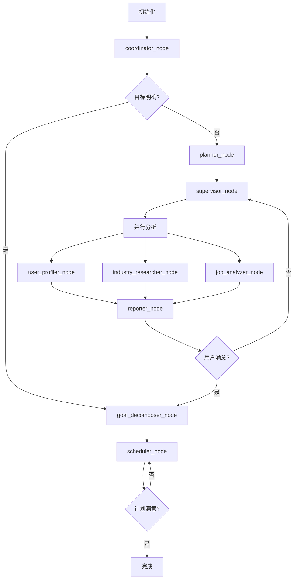

# CareerNavigator LangGraph 状态流转图

## 简化流程图



## 详细状态字段流转

### 核心状态字段变化时序

```
时间轴: 节点执行顺序
字段变化: 每个节点对状态的修改

初始化 → coordinator → planner → supervisor → 并行分析 → reporter → [迭代] → goal_decomposer → scheduler → 完成
  ↓           ↓          ↓         ↓          ↓           ↓        ↓         ↓              ↓         ↓
session_id   stage     planning   tasks    analysis   report  feedback   goals        plan     final
messages     cached     strategy   created  results    ready   loop      defined      ready    state
profile      route                                    waiting                        waiting
```

### 关键决策点

1. **coordinator_node 路由决策**
   ```
   输入: user_message, user_profile
   决策: LLM分析 → is_goal_clear, clarity_score
   路由: 
   - clarity_score > 70 → goal_decomposer (跳过分析)
   - clarity_score ≤ 70 → planner (进入分析流程)
   ```

2. **reporter_node 满意度判断**
   ```
   输入: integrated_report
   等待: 用户反馈 (console input)
   决策: satisfaction_level
   路由:
   - SATISFIED/VERY_SATISFIED → goal_decomposer
   - 其他 → supervisor (重新分析)
   ```

3. **迭代控制机制**
   ```
   检查: iteration_count vs max_iterations
   限制: 默认最大3次迭代
   强制: 达到限制时强制进入下一阶段
   ```

### 状态持久化策略

#### 关键字段保护列表
```python
CRITICAL_FIELDS = [
    "session_id",           # 会话标识
    "user_profile",         # 用户信息
    "messages",             # 对话历史
    "current_stage",        # 当前阶段
    "iteration_count",      # 迭代计数
    "max_iterations",       # 迭代限制
    "agent_tasks",          # 任务队列
    "agent_outputs",        # 输出结果
    "user_feedback_history", # 反馈历史
    "system_metrics",       # 系统指标
    "error_log"             # 错误日志
]
```

#### 状态恢复机制
```python
# 在用户反馈后恢复状态完整性
def restore_state_integrity(updated_state, original_state):
    for field in CRITICAL_FIELDS:
        if field not in updated_state and field in original_state:
            updated_state[field] = original_state[field]
    
    # 确保默认值
    updated_state.setdefault("messages", [])
    updated_state.setdefault("agent_tasks", [])
    updated_state.setdefault("agent_outputs", [])
    updated_state.setdefault("error_log", [])
```

## 异常处理与错误恢复

### 节点失败处理
```python
try:
    # 节点执行逻辑
    result = execute_node_logic(state)
    return result
except Exception as e:
    # 记录错误
    error_info = {
        "node_name": node_name,
        "error_message": str(e),
        "state_snapshot": extract_key_fields(state)
    }
    return StateUpdater.log_error(state, error_info)
```

### 状态回滚机制
```python
def safe_state_transition(current_state, transition_func):
    """安全的状态转换，支持回滚"""
    backup_state = deep_copy_critical_fields(current_state)
    try:
        new_state = transition_func(current_state)
        if validate_state_integrity(new_state):
            return new_state
        else:
            return restore_from_backup(backup_state)
    except Exception:
        return restore_from_backup(backup_state)
```

## 性能优化建议

### 1. 状态字段优化
- 避免在状态中存储大型对象
- 使用引用而非完整对象拷贝
- 定期清理历史数据

### 2. 并发处理优化
```python
# 使用Annotated支持并发累加
agent_outputs: Annotated[List[AgentOutput], operator.add]
agent_tasks: Annotated[List[AgentTask], operator.add]
error_log: Annotated[List[Dict], operator.add]
```

### 3. 内存管理
```python
# 定期清理非必要历史数据
def cleanup_old_data(state, max_history=10):
    if len(state.get("performance_logs", [])) > max_history:
        state["performance_logs"] = state["performance_logs"][-max_history:]
    
    if len(state.get("mcp_call_history", [])) > max_history:
        state["mcp_call_history"] = state["mcp_call_history"][-max_history:]
```

## 测试策略

### 单元测试
```python
def test_coordinator_routing():
    """测试coordinator节点的路由逻辑"""
    # 测试目标明确的情况
    clear_goal_state = create_test_state(goal_clarity=80)
    result = coordinator_node(clear_goal_state)
    assert result["next_node"] == "goal_decomposer"
    
    # 测试目标不明确的情况
    unclear_goal_state = create_test_state(goal_clarity=40)
    result = coordinator_node(unclear_goal_state)
    assert result["next_node"] == "planner"
```

### 集成测试
```python
def test_feedback_iteration_loop():
    """测试反馈迭代循环"""
    state = create_initial_state()
    
    # 执行到reporter阶段
    state = run_until_stage(state, WorkflowStage.USER_FEEDBACK)
    
    # 模拟用户不满意
    state = simulate_user_feedback(state, UserSatisfactionLevel.DISSATISFIED)
    
    # 验证返回supervisor
    next_result = run_one_step(state)
    assert "supervisor" in next_result
```

### 压力测试
```python
def test_iteration_limit():
    """测试迭代限制机制"""
    state = create_initial_state()
    state["max_iterations"] = 2
    
    # 连续模拟不满意反馈
    for i in range(5):
        state = simulate_dissatisfied_feedback(state)
        if state["iteration_count"] >= state["max_iterations"]:
            break
    
    # 验证强制进入下一阶段
    assert state["iteration_count"] <= state["max_iterations"]
```

---

## 总结

这份流程图文档提供了CareerNavigator LangGraph系统的可视化指南，帮助开发者理解：

1. **流程逻辑**: 节点间的连接关系和决策逻辑
2. **状态管理**: 关键字段的生命周期和变化规律  
3. **异常处理**: 错误恢复和状态回滚机制
4. **性能优化**: 内存管理和并发处理策略
5. **测试方法**: 单元、集成和压力测试策略

结合主文档使用，为系统的开发、维护和扩展提供完整的技术指南。
