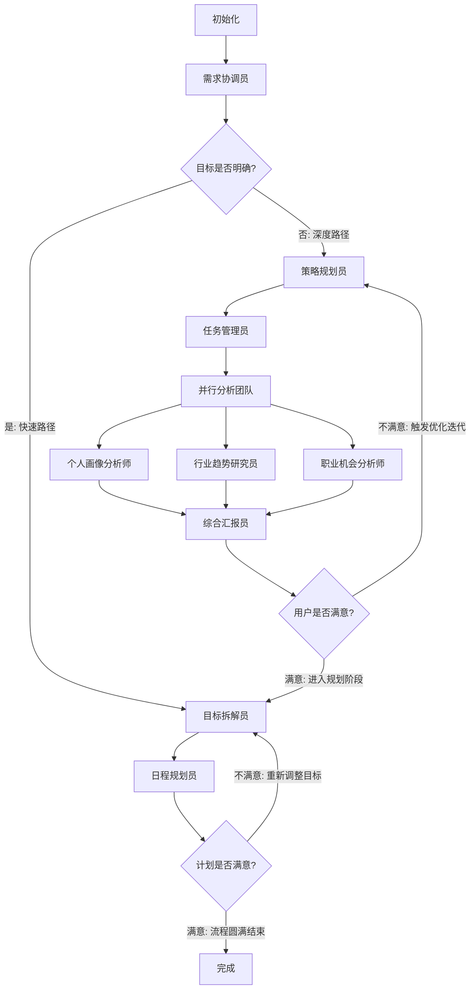

# CareerNavigator 技术设计文档

本文档详细介绍了 CareerNavigator 的系统架构、LangGraph 工作流设计、状态管理机制以及核心节点逻辑。

## 🏗️ 系统架构

CareerNavigator 采用前后端分离架构，后端基于 Flask 和 LangGraph 构建，前端使用 React。

- **后端**: Python 3.11+, Flask, LangGraph, LangChain, DashScope API
- **前端**: React, Tailwind CSS (由 Flask 静态服务托管)
- **工作流**: 基于状态机的智能多智能体协作系统

## 🔄 LangGraph 工作流设计

系统核心是一个基于 LangGraph 构建的智能工作流，它将复杂的职业规划任务分解为多个原子化的节点，并通过状态机进行驱动。LangGraph 作为 LangChain 生态的工作流引擎，为我们提供了强大的图计算、状态管理和持久化能力。

### 1. 核心架构组件与机制

#### 1.1 统一状态视图 (Unified State Graph)
系统采用“单一事实来源”的设计模式。整个工作流共享一个全局状态对象，这带来了以下核心优势：
-   **上下文无缝传递**: 每一个节点（如行业研究员）都能访问到之前所有节点（如个人画像分析）产生的信息，无需复杂的参数传递。
-   **决策透明化**: 路由节点可以根据状态中的任何细微变化（如用户满意度评分）来决定下一步的走向。
-   **数据一致性**: 状态的更新是原子性的，确保了在复杂的并行计算中，数据始终保持同步且不冲突。

#### 1.2 检查点与持久化机制 (Checkpointing & Persistence)
这是系统支持长时会话的关键。通过为每个会话分配唯一的标识符，系统能够：
-   **状态“冷冻”与“解冻”**: 当工作流遇到需要人工干预的节点时，它会将当前的所有内存状态、变量和执行进度“冷冻”到持久化存储中。
-   **跨时空恢复**: 用户可以在几分钟甚至几天后重新连接，系统通过会话标识符找到对应的检查点，将状态“解冻”并从精确的中断点继续执行。
-   **容错与重试**: 如果某个节点执行失败，系统可以回溯到上一个成功的检查点重新尝试，而不需要从头开始整个流程。

#### 1.3 动态路由与条件边 (Dynamic Routing)
工作流不是线性的，而是根据实时分析结果动态生成的：
-   **智能分流**: 协调员节点会评估用户目标的清晰度。如果目标明确，工作流会自动“剪枝”，跳过不必要的分析步骤，直接进入规划阶段。
-   **反馈循环**: 路由逻辑支持“回退”操作。如果用户对结果不满意，工作流可以引导执行流回到之前的节点进行重新生成，形成一个闭环的优化过程。

#### 1.4 并行协作与结果汇聚 (Fan-out/Fan-in)
为了模拟真实专家团队的工作模式，系统实现了并行处理机制：
-   **任务扇出**: 管理员节点可以将一个复杂的任务拆解为多个子任务，并同时启动多个专门的智能体（如行业研究员、个人画像分析师）。
-   **结果汇聚**: 系统会自动等待所有并行任务完成，并将它们产生的碎片化信息（如行业数据、技能评估）自动合并到一个统一的结果集中，供后续的汇报员节点进行综合处理。

---

## 🤝 人机交互 (HCI) 深度设计

CareerNavigator 的设计哲学是“AI 辅助，人类决策”。我们通过一系列技术手段，将 AI 的自动化能力与人类的判断力深度融合。

### 1. “等待-恢复”交互模式 (Wait-and-Resume)

这是实现“人机协作”的核心模式。系统通过以下步骤实现深度交互：
-   **主动中断**: 在生成关键报告或计划后，工作流会主动进入“挂起”状态。此时，AI 停止计算，释放资源，并向前端发出“等待输入”的信号。
-   **状态注入**: 用户在界面上看到的不仅仅是静态文本，而是一个交互式的反馈窗口。用户提交的每一条建议或评分，都会被后端转化为特定的状态更新，并“注入”到被挂起的工作流中。
-   **无缝衔接**: 一旦反馈注入完成，工作流会立即被“唤醒”。它会读取新注入的反馈，并根据这些信息决定是继续前进还是返回修改。

### 2. 实时流式反馈与进度感知 (Streaming UX)

由于 AI 处理复杂职业规划任务需要一定时间，我们通过流式技术解决了用户的“黑盒焦虑”：
-   **思维链展示**: 用户可以实时看到 AI 正在哪个节点工作，以及该节点正在思考的具体内容。这种透明度增强了用户对 AI 结果的信任感。
-   - **增量渲染**: 报告不是一次性弹出的，而是像人类打字一样逐字逐句生成的。这种动态感让用户能够同步阅读，减少了感知的等待时间。
-   **并行进度条**: 当多个分析智能体同时工作时，界面会展示多个并行的进度状态，让用户直观感受到系统正在进行多维度的深度分析。

### 3. 零门槛信息采集 (Zero-Entry Interaction)

为了降低用户填写长表单的负担，我们引入了基于 OCR 的智能交互：
-   **视觉解析**: 用户只需上传一张简历图片，系统就会自动启动视觉识别引擎。
-   **语义映射**: 识别出的原始文本会被 AI 自动归类到姓名、技能、经历等标准字段中。
-   **核对式输入**: 用户不再需要从零开始打字，而是变成了“审核员”，只需核对 AI 自动填充的信息是否准确。这种从“输入”到“核对”的转变，极大地提升了用户体验。

### 4. 迭代式优化体验

系统鼓励用户进行多次微调：
-   **渐进式明晰**: 职业规划往往是一个从模糊到清晰的过程。系统允许用户在每一轮迭代中加入新的想法，AI 会在保留原有上下文的基础上进行增量优化。
-   **满意度闭环**: 只有当用户明确表示“满意”时，流程才会进入下一个大阶段。这种设计确保了最终产出的方案是用户真正认可的。

### 2. 流程图与节点逻辑

### 3. 关键节点深度解析

#### 3.1 智能路由节点 (Intelligent Routing)
**协调员节点**的核心作用是对用户需求进行智能分类：
- **需求理解**: 首先分析用户的职业目标陈述是否足够明确具体。明确的目标（如"在3年内升任技术总监"）可以快速进入规划阶段；模糊的目标（如"寻求职业改变"）则需要先进行深度分析以理清思路。
- **自适应加速**: 这一设计避免了对目标明确的用户进行冗余的分析，显著缩短了处理时间。
- **条件路由逻辑**: 基于明确度评分，工作流自动选择"快路径"（直接规划）或"完整路径"（全面分析）。

#### 3.2 并行多任务处理 (Parallel Execution)
**并行分析架构**充分利用了 LangGraph 的并发能力：
- **扇出设计**: 一旦进入分析阶段，系统会同时启动三个独立的分析任务：
  - **个人画像分析**: 深入评估用户的技能深度、职业经历、软技能和学习潜力。
  - **行业趋势研究**: 收集目标行业的薪资水平、技能需求、发展前景和竞争格局。
  - **职位匹配分析**: 基于用户画像和行业数据，计算用户与目标职位的匹配度并识别差距。
- **异步汇聚**: 三个任务可以独立并行执行，无需等待其他任务完成。当全部任务结束后，系统自动汇聚所有结果用于后续的报告生成。
- **效率提升**: 与顺序执行相比，并行处理可以将总耗时从 3T 减少到 T（其中 T 是单个任务的时间）。

#### 3.3 迭代与收敛控制 (Iteration & Convergence)
职业规划通常需要多轮反馈调整。系统设置了智能的迭代控制机制：
- **反馈驱动的迭代**: 当用户对初次分析结果表示不满意时，系统不是简单地重新运行相同的分析，而是根据用户的具体反馈（如"分析忽略了我的管理经验"）来调整分析策略。
- **收敛保证**: 为防止无限循环，系统设置了最大迭代次数限制（默认 3 次）。即使用户仍未完全满意，达到上限后系统也会进入规划阶段。这保障了流程的最终完成。
- **渐进式优化**: 每一轮迭代都会累积用户的反馈信息，形成一个逐步优化的过程，最终生成的规划方案会比初次版本更加贴切。

---

## 🤝 人机交互 (HCI) 深度解析

CareerNavigator 的核心特色在于其深度的人机协作模式，确保 AI 生成的内容符合用户的真实预期。

### 1. 中断与恢复机制 (HITL)

系统在以下两个关键点设置了中断：
1.  **分析报告确认 (`reporter`)**: 当 AI 完成深度分析并生成 `integrated_report` 后，工作流进入 `USER_FEEDBACK` 阶段并暂停。
2.  **行动计划确认 (`scheduler`)**: 当 AI 生成详细的 `final_plan` 后，工作流再次暂停。

**交互流程**:
1.  工作流运行至中断点，状态保存至 Checkpointer。
2.  前端通过 `/api/career/status` 轮询发现 `requires_user_input: true`。
3.  用户在界面上查看结果并提交反馈（满意度 + 文本建议）。
4.  后端调用 `update_user_feedback` 更新状态，并调用 `app.update_state` 将反馈注入工作流。
5.  后端调用 `app.stream(None, config)` 恢复执行，工作流根据新注入的满意度进行条件路由。

### 2. 实时流式反馈 (SSE)

为了提升用户体验，系统实现了基于 Server-Sent Events (SSE) 的实时反馈：
-   **节点状态追踪**: 前端可以实时看到哪个节点正在运行（如“行业研究员正在收集数据...”）。
-   **内容增量展示**: 节点生成的中间内容会实时推送到前端，减少用户的等待焦虑感。
-   **并行展示**: 前端支持同时展示多个并行分析节点的进度。

### 3. 简历 OCR 交互

-   **异步处理**: 用户上传简历图片后，后端启动异步任务调用 PaddleOCR。
-   **智能映射**: OCR 提取的非结构化文本由 LLM 进一步处理，映射到 `UserProfile` 的标准字段（如年龄、技能、工作年限）。
-   **自动填充**: 解析结果返回前端后，自动填充问卷表单，用户仅需核对修改，极大降低了输入成本。

## 🔍 核心技术实现细节

### 1. 多智能体协作 (Multi-Agent Collaboration)

系统采用了“协调员-执行员-监督员”的协作模式：
-   **任务分发**: `supervisor` 节点不仅是简单的中转，它会根据 `planner` 设定的策略，为每个并行节点生成特定的 `AgentTask`。
-   **结构化输出**: 所有节点都强制要求 LLM 返回 JSON 格式。为了应对 LLM 输出的不确定性，系统在 `src/services/career_nodes.py` 中实现了一个极其鲁棒的 `parse_llm_json_content` 函数，支持从 Markdown 代码块、截断的字符串甚至杂乱文本中提取 JSON。

### 2. OCR 简历解析引擎

-   **技术栈**: 基于 PaddleOCR 框架。
-   **处理流程**:
    1.  前端上传图片至 `/api/career/upload-resume`。
    2.  后端保存临时文件并调用 `PaddleOCRClient`。
    3.  OCR 提取原始文本行。
    4.  **语义提取**: 原始文本被送入 LLM，利用 Few-shot Prompting 技术将其转换为结构化的 `UserProfile` 对象。
    5.  **隐私保护**: 临时文件在解析完成后立即删除。

### 3. 状态更新与验证

-   **StateUpdater**: 封装了所有状态修改逻辑，确保状态更新的原子性和一致性。
-   **StateValidator**: 在节点转换前验证必要字段（如：进入 `goal_decomposition` 前必须存在 `integrated_report`），增强了系统的健壮性。
